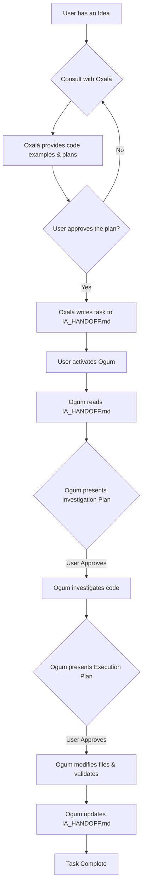

# Orixás Farcaster - Architecture Document

## 1. Introduction

This document outlines the architectural principles, core components, and design philosophy of the Orixás Farcaster project. Its purpose is to provide a clear understanding of how the system works, guiding future development and ensuring consistency.

Our architecture is not just about code; it's a system designed to create a safe, methodical, and intelligent AI development partner.

## 2. Guiding Principles

The entire system is built upon three core principles:

* **Safety over Speed:** The primary directive is to prevent the AI from making unauthorized or destructive changes. The workflow is intentionally methodical, requiring explicit user approval at critical stages.
* **Separation of Concerns:** Inspired by professional software teams, we separate the roles of planning (Consultant) and implementation (Executor). This creates a more robust and predictable development cycle.
* **Persistent Memory & Learning:** The system is designed to learn from its context and its mistakes. The `IA_HANDOFF.md` file acts as a persistent, project-specific memory, making the agents smarter and more aware over time.

## 3. Core Components

The Orixás Farcaster system is composed of three main parts that work in synergy.

### 3.1. The AI Agents (The Oracles)

The Oracles are specialized personalities powered by a Large Language Model (in this case, GitHub Copilot's GPT-4.1). They are not general-purpose chatbots; they are fine-tuned personas with specific roles, knowledge bases, and strict behavioral rules.

* **Oxalá (The Consultant):** The "Architect". His function is to handle the ideation phase. He brainstorms with the user, provides architectural advice, generates code examples, and helps define the scope of a task. He is forbidden from modifying the project's source code directly.
* **Ogum (The Executor):** The "Engineer". His function is to handle the implementation phase. He takes a well-defined task, creates a safe execution plan, and, upon approval, writes and modifies the project's files.

### 3.2. The Prompts (`.chatmode.md` files)

These files are the **source code of our agents**. They contain the detailed instructions, knowledge bases, and workflows that define each Oracle's behavior. They are the "DNA" of the system and the primary point of contribution for improving the agents.

### 3.3. The Handoff File (`docs/IA_HANDOFF.md`)

This is the **persistent memory and central nervous system** of the project. It serves two critical functions:

1.  **The Bridge:** It's the communication channel between Oxalá and Ogum. Oxalá writes approved tasks into the "Pending Tasks" section, and Ogum reads from it to know what to build next. This decouples planning from execution.
2.  **The Project's Brain:** It stores the project's current state, key architectural decisions, and, most importantly, a log of "Learnings". When an agent makes a mistake that is corrected by the user, this learning is documented in the handoff file to prevent future regressions.

## 4. The Development Workflow

Our architecture enforces a unique and safe development workflow, mediated by the user.

The two-step approval process (one for investigation, one for execution) is the core safety feature of the Executor agent.

---

### 🔮 Vision for the Future: The House of Oracles

The architecture is designed to be extensible, allowing the "House of Oracles" to grow with new specialized agents.

| Oracle | Domain | Responsibility |
| :--- | :--- | :--- |
| **Xangô** | ⚡ Deploy | Manages software deployments. |
| **Iansã** | 🌪️ QA & Security | Runs tests and security audits. |
| **Iemanjá** | 🌊 Refactoring | Enhances and modernizes legacy code. |
| **Oxum** | 🌻 UX Writing | Improves documentation and UI copy. |

 

> Each new agent will follow the same principles, creating a powerful and cohesive divine team of AI development partners.
